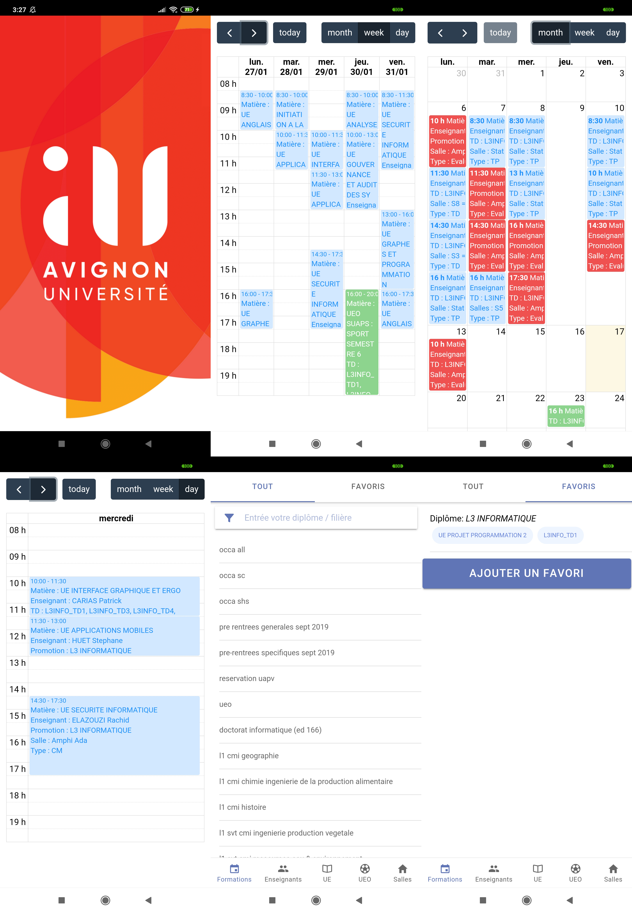

# EDT - UAPV

Allow to the Avignon University students to check their timetable on Android and IOS.

Author:
* Yanis Labrak

## Installation
Here is the procedure to install this software :
1. npm install

## Use
1. In order to use the software, you must have an internet connection
2. You need to have all the tools and depencencies installed
3. Run the software
   1. ionic cordova run android --livereload --device --consolelogs
4. Select your academic promotion directly or from the bookmarks section
5. Click on the course and add the course to the Google Calendar by pressing the timetable icon

## Dependencies

The project relies on the following libraries:
* FullCalendar: The Angular version of the FullCalendar.JS library [Source](https://fullcalendar.io/docs/angular)

And the following services:
* edt-api.univ-avignon.fr: This service was used for fetching the courses data needed for the calendar

## Development environement
* Angular: [Source](https://angular.io/)
* Ionic: [Source](https://ionicframework.com/)
* Apache Cordova: [Source](https://cordova.apache.org/)
* SQLite-porter: [Source](https://ionicframework.com/docs/native/sqlite-porter)

## References
During development, I use the following bibliographic resources:
* [Ionic Documentation](https://ionicframework.com/docs): Its the offical Ionic documentation.
* [Simon Grimm](https://www.youtube.com/user/saimon1924/videos): A nice Youtube channel where we can found everythings we need about Ionic.